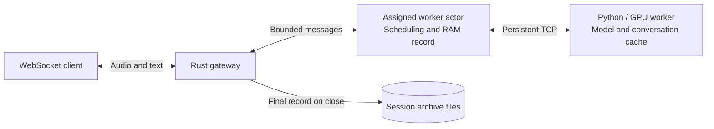

# Turn-based Rust speech inference scheduler

A Tokio gateway schedules persistent audio conversations across a configurable list of GPU workers. Ordinary WebSocket clients send user audio, commit the turn and receive streamed text tokens. Rust owns admission, sticky placement, turn state, dynamic batching, interruption and output acceptance. A persistent Python process per GPU owns the PyTorch model and complete hybrid conversation cache. There is no authentication, database, frontend or text-to-speech stage.

The model is Whisper Small, a speech projection layer and Qwen3.5-2B. The serving target is **10 Hz audio embeddings**, with **100 ms audio packets** from clients. Complete utterances are encoded at commit because Whisper is bidirectional. Prior audio embeddings and accepted assistant tokens stay in the worker's cache across turns. The initial deployment may have two GPUs; the endpoint list controls GPU count.

Start with the **[visual architecture guide](docs/ARCHITECTURE.md)** for seven Mermaid diagrams covering the system, one turn, computation, cache/storage ownership, batching, interruption and shutdown. Each diagram links to the code that implements it.



The agreed design is in [PLAN.md](PLAN.md), implementation decisions in [docs/IMPLEMENTATION.md](docs/IMPLEMENTATION.md), measured local results in [docs/LOCAL_VALIDATION.md](docs/LOCAL_VALIDATION.md), and GPU checks in [docs/HARDWARE_VALIDATION.md](docs/HARDWARE_VALIDATION.md). The [model integration status](docs/MODEL_INTEGRATION.md) records the checked training architecture and remaining checkpoint/hardware work. [PERFORMANCE.md](PERFORMANCE.md) preserves measurements of the superseded periodic audio-echo workload; those results do not establish this model's capacity. The old TCP echo transport and simulator have been replaced.

The [RTX 3090 benchmark report](docs/GPU_BENCHMARK_3090.md) records the completed step-9,550 checkpoint, 65 passing on-node Python tests and real-speech workloads through 80 offered sessions. The two 32-session runs measured 148–164 aggregate model tokens/s with active-turn rejections. Churn, interruption, bounded archive backpressure and exact audio/token archival passed. The report includes percentile tables, configuration, a data-flow diagram and current startup commands. Model quality and sustained capacity remain unmeasured. The earlier [shared-node smoke deployment](docs/DEPLOYMENT_3090.md) is retained as historical evidence.

## Run the pipeline

Start actual model workers using [backend/README.md](backend/README.md). For local orchestration measurements, the separate test fixture implements the same worker protocol without loading a model:

```powershell
# Terminal 1, from backend/.
uv run python tests/fixture_worker.py --port 9100 --response-tokens 12 --prefill-ms 20 --decode-ms 12

# Terminal 2, from the repository root.
cargo run --release -- serve --runtime-config examples/runtime.json

# Terminal 3: ordinary clients, random starts and 100 ms packets.
cargo run --release -- benchmark --sessions 1 --turns 3
cargo run --release -- benchmark --sessions 16 --turns 3 --report benchmark-results/turns.json
cargo run --release -- benchmark --sessions 16 --turns 4 --interrupt-after-tokens 3 --churn-rounds 3 --report benchmark-results/interruption.json
cargo run --release -- suite --session-budget 16 --sessions 8 --turns 2 --report benchmark-results/suite.json
cargo run --example session
```

The fixture charges its full configured duration for every nonempty batch. Its response has 12 ordinary tokens followed by an accepted EOS token. This exercises transport, cache and scheduling; it does not measure GPU performance. `benchmark` connects to an independently running gateway and never bypasses the network. `suite` offers low/50%/80%/95%/120% of the explicit session budget, then aligned starts at 100 ms cadence, jitter with 100–110 ms capture intervals, churn and interruption. The budget is an offered-load reference rather than measured hardware capacity.

Run the one-session warmup first so reactive estimates have observations. The example starts with a conservative 100 ms unknown-forward estimate; it can reject turns until it learns the active batch/context shapes. Warmup does not establish every future shape's cost or guarantee that all offered sessions will be accepted. Inspect reported rejections and measured hardware results before raising capacity.

Use `--audio-file path/to/audio.pcm` for real speech. It must contain raw little-endian signed PCM16, mono, 16 kHz, up to 30 seconds. The benchmark sends silence when omitted. Use `--url ws://host:8080/v1` for another machine. Default packets contain 100 ms of audio: 1,600 samples / 3,200 PCM bytes. A final shorter packet retains the utterance tail. `--minimum-packet-ms` and `--maximum-packet-ms` remain configurable for timing experiments; packet length follows the sampled capture interval. The gateway validates order and sample counts rather than imposing a wall-clock arrival rate. Model embedding frequency is determined by the projector, independently of transport packet boundaries.

`examples/runtime.json` is the canonical runtime configuration. Add or remove worker endpoints to change GPU count. Each endpoint refers to a ready, warmed worker exclusively owned by this gateway. Runtime JSON is strict: important fields are explicit and unknown fields fail. Tune session/cache limits, active-turn reservations, batch limits and reactive timing headroom on actual hardware. CLI `--listen`, `--max-connections`, `--archive-directory` and `--no-archive` concern only the gateway.

## Public WebSocket protocol, version 1

Connect to `/v1`; other paths receive an HTTP rejection. One connection owns one session. Controls and events are strict JSON tagged by `type`; unknown fields are rejected. Session IDs contain 1–128 bytes; turn IDs are unique within a session. This protocol version fixes audio to signed PCM16, mono, 16 kHz.

```json
{"type":"open","session_id":"conversation-123"}
{"type":"start_turn","turn_id":1}
{"type":"commit","turn_id":1,"chunk_count":10,"sample_count":16000}
{"type":"cancel","turn_id":1}
{"type":"close"}
```

After `start_turn` and before `commit`, send binary messages: eight bytes of little-endian `turn_id`, four bytes of little-endian zero-based `chunk_index`, then nonempty PCM16 samples. Indices must be contiguous; commit chunk/sample counts must match exactly. Duplicate commits with identical counts are idempotent. Post-commit audio needs a new turn. `start_turn` interrupts active generation and obtains the new capture reservation; rejected turns never accept audio.

Events are `opened {session_id,worker_id}`, `accepted {turn_id}`, `text_delta {turn_id,generation,sequence,token_id,text}`, `finished {turn_id,generation,reason,generated_tokens}`, `failed {turn_id,code,message}` and `closed {session_id}`. EOS is an accepted model token and may have an empty text delta. A delta is not necessarily a word or character. Counts include EOS and empty deltas. Stable enum failure codes identify rejected work.

The worker actor defines acceptance order. Interruption prevents further proposals from being accepted or consumed into cache. Already accepted events retain FIFO stream order before the next turn's acceptance, even when network delivery lags. Archives record accepted output rather than a delivery acknowledgement; a broken connection can retain committed tokens the client never received.

Connection count, frame/message sizes, outbound queues and handshake/write/idle waits are bounded. The default incoming message limit is 16 KiB. A slow writer closes only its own connection. Audio/history limits belong to the runtime. Explicit close drains accepted events before `closed`; disconnect and shutdown also release backend state. Output activity keeps an active generator alive without requiring incoming audio.

## Measurements and admission

The objective is at least four accepted model tokens per second per generating session after its first token. The 250 ms next-token target is separate from end-of-turn-to-first-token latency. Reactive admission uses observed forward durations, batch shapes and context, reserves headroom and rejects turns when the budget is exhausted. It never assumes half-full batches take half the time.

Client reports include TTFT and token-gap p50/p95/p99/max, aggregate throughput, per-session rates, rejections, failures and interruptions. Rolling throughput defaults to a two-second window sampled every 100 ms, including stalls without new output. Gaps above target are reported separately. Short responses have no rolling sample if they never span the window; token gaps and complete-turn rates remain visible. The response timeout bounds a whole generation. Aggregate wall throughput includes capture/thinking time; per-turn token rates exclude those phases. Churn closes conversations between rounds and creates fresh sessions.

On Ctrl+C, the gateway closes sessions, drains archive work and prints admissions/rejections, stale proposals, saturation, queue/forward/stage distributions, batch fill, worker utilization and backend memory observations. Speech quality, GPU cache parity, VRAM limits and sustainable concurrency require the trained checkpoint and hardware validation.

## Session records

Closed conversations are archived under `session-archives/` by default. Records contain timestamps, session/worker IDs, backend model/manifest identity, original PCM16, turn commit/finish state, exact accepted token IDs/text and token timing. Audio is currently represented as JSON integer arrays: inspectable but less compact than binary sidecars. History is bounded and never silently truncated.

Archival has a bounded queue and one blocking file writer outside Tokio async workers. Files are flushed, synced and atomically renamed from a temporary file. A full archive queue delays connection teardown while preserving the record; inference workers continue independently. Each waiting connection retains its connection permit, bounding pending records by the connection limit plus archive queue capacity and one writer. Backpressure is counted; a stopped writer or disk error is logged and counted. Configure disk throughput for expected churn.

## Code and validation

`runtime.rs` exposes `Node`, `Ingress` and session handles. `session/` owns placement/lifecycle and records; `worker/` owns scheduling/execution; `scheduler/` owns fairness/cost estimates. `protocol/` defines canonical public models and the typed backend boundary. `transport/` separates connection control, bounded writing, client/codec and archives. `simulation/` contains ordinary network workloads and client measurements. Model-specific code lives under `backend/src/voice_worker/`.

```powershell
cargo fmt --check
cargo clippy --all-targets --locked -- -D warnings
cargo test --locked
# After installing the backend uv environment:
cargo test --locked --test transport python_worker_process_to_websocket_client_full_pipeline -- --ignored --nocapture
```

Ordinary Rust tests use test-local workers over real framed TCP. The explicit cross-language test starts a Python fixture process and exercises IPC, Rust scheduling and ordinary WebSocket clients together. Python and GPU test instructions are in the backend README.
