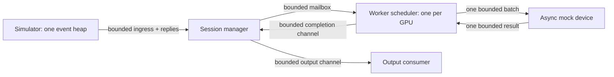

# Rust realtime voice inference scheduler

A small Tokio prototype of an inference node serving persistent voice sessions on simulated GPU workers. The model is an async sleep; the serving runtime, lifecycle, overload policies, scheduling, and measurements are real.

## Run

Install a current stable Rust toolchain with Rustfmt and Clippy. The crate uses Rust 2024 and let chains. On Windows, use either the MSVC toolchain with C++ build tools or the GNU toolchain with MinGW.

```powershell
cargo run --release -- benchmark --workers 8 --sessions 400 --batch-size 16 --tick-ms 50 --inference-ms 12 --duration-secs 60
```

Compare all 14 default scenarios, saving full configuration and per-worker distributions:

```powershell
cargo run --release -- suite --duration-secs 10 --output .\benchmark-results\suite.json
```

The suite covers 10%, 50%, 80%, 95%, and 120% of admission capacity; aligned and random arrivals; ±2/5/10 ms jitter; random arrivals with 5/10 ms phase buckets; churn; a slow input consumer; and a 12→20 ms device slowdown. Incompatible jitter/bucket scenarios are omitted when using very short tick intervals. Churn durations in the suite are between 10% and 50% of each scenario's duration, so short smoke runs exercise replacement too.

Individual experiments:

```powershell
cargo run --release -- benchmark --arrival-phase random --jitter-ms 5 --phase-bucket-ms 10 --duration-secs 10
cargo run --release -- benchmark --sessions 500 --duration-secs 10
cargo run --release -- benchmark --churn-min-ms 10000 --churn-max-ms 300000 --duration-secs 60
cargo run --release -- benchmark --slowdown-after-ms 5000 --slowdown-inference-ms 20 --duration-secs 10
cargo run --release -- benchmark --worker-capacity 1 --worker-input-delay-ms 2 --duration-secs 10
cargo run --release -- benchmark --workers 40 --sessions 2000 --duration-secs 10
cargo run --release -- benchmark --duration-secs 2 --json
cargo run --example session
cargo run -- benchmark --help
```

`--json` emits only the JSON result to stdout. `--output` saves the complete report in addition to stdout. Ctrl+C returns a partial report and drains running device jobs. Seeds reproduce random workload choices, not operating-system timing.

## Ownership and message flow



The session manager owns the session-to-worker map, per-worker admission counts, generations, timeout handling, and output dispatch. Each scheduler exclusively owns its sessions, pending inputs, deadlines, cache pool, and in-flight batch. The mock device runs in its own Tokio task. Nothing uses a shared mutable scheduler map or an actor framework. Shared ownership is limited to immutable configuration, cancellation tokens, and ingress saturation counters implemented as atomics.

There are `2 × workers + 1` runtime tasks, plus the simulator and output consumer. There is no task or OS thread per session. Tokio uses a fixed thread pool, and the mock device never blocks those threads. A real blocking device implementation would belong on dedicated threads or `spawn_blocking`.

The public boundary is `Node` and its cloneable `Ingress` handle. `create_session`, `input_frame`, and `close_session` use typed replies. `take_outputs` transfers the single bounded output receiver. `shutdown` joins the manager and every scheduler/device task; dropping the node requests cancellation. See `examples/session.rs` for a complete lifecycle.

## Admission and locality

Placement is encapsulated by `PlacementPolicy`; `LeastLoaded` chooses the lowest active session count, breaking ties by worker ID. Alternative policies can be injected with `Node::start_with_policy`. Assignments remain sticky until close or timeout.

Admission requires both a compute slot and a cache slot. The default is 52 sessions per worker with 64 cache slots, giving 416 sessions per node. Idealized throughput is `floor(50 / 12) × 16 = 64` sessions per worker, so the default leaves compute headroom. This is a static admission target, not a hard realtime guarantee on arbitrary hosts. Slowdown exposes misses; it does not automatically change admission limits. Tune the limit against measured latency tails.

Cache handles are private to the worker module and tagged with their worker ID. Allocation/freeing and ownership assertions go through that worker's pool. A close frees its cache slot before acknowledging. No migration path exists. The mock batch owns its frame and identity, so freeing a fake cache slot during physical inference is safe here; a real GPU backend would need a fence before reusing device memory still referenced by a kernel.

## Scheduling

Every session has a generation, a next deadline, a phase start, one replaceable pending input, and an in-flight flag. A session can participate in only one running batch. Input arriving during inference remains pending for its next tick.

1. Ready sessions must have input, be outside an active batch, and have reached their phase start.
2. Full batches launch immediately. Partial batches wait until the earliest deadline minus estimated inference time and the configurable scheduling margin.
3. Batch construction sorts eligible sessions by earliest deadline, then by session ID. Membership is reconstructed for every batch.
4. On completion, the next deadline advances by one tick and the next phase starts at the preceding deadline. The initial deadline is one tick after arrival or its quantized phase start. Fresh pending input can advance past obsolete ticks, using the nearest tick on the same phase grid; skipped inference ticks are counted. This prevents deliberately dropped input from permanently shifting subsequent work behind its deadline.

The inference estimate starts with configured latency and conservatively retains the largest observed device duration. This accounts for mock timer overhead and slowdown when deciding when to launch partial batches. It does not predict all future timer or CPU delays. Workers can process several batches between ticks.

Phase quantization rounds a new session's start upward relative to the node epoch. `phase_added_latency` measures this start offset; compare end-to-end latency across experiments to see its total effect. Jitter is sampled independently around each periodic input tick, rather than accumulating a random walk. Jitter must be less than half a tick to keep input times ordered.

The initial EDF implementation scans and sorts the bounded worker session set. With roughly 52 sessions per worker this keeps the design explicit. An indexed heap would be a useful follow-up if profiling shows this dominates at much larger worker capacities.

## Bounded memory and overload behavior

| Boundary or state | Policy |
| --- | --- |
| Ingress input mailbox | `try_send`; full returns `InputOutcome::Overloaded` |
| Manager-to-worker input mailbox | `try_send`; full rejects that frame |
| Create/close control messages | Wait for bounded mailbox space; never silently drop a lifecycle command |
| Per-session pending input | Latest frame replaces previous pending frame; count coalescing |
| Device work and return mailboxes | Capacity one; at most one device batch per worker |
| Worker-to-manager completions | Drop result when full and count saturation |
| Public output mailbox | Drop result when full and count saturation; a disconnected consumer also drops results, without counting saturation |
| Stale input | Drop when older than `max_input_age`, including recheck before batching |
| Payload | Reject frames larger than `max_frame_bytes`, or with future timestamps |
| Idle session | Close after `session_timeout` without an accepted input |

`Accepted` means the frame entered the worker mailbox; it can subsequently be replaced, expire, or be cancelled. It does not promise an output for every frame. Inputs are expected to be prepared before calling the API; callers also need to bound their own producer tasks and buffers.

Runtime session state is bounded by `workers × min(compute_limit, cache_slots)`. Pending inputs are bounded to one per session, with at most one batch's inputs in flight per worker. Mailboxes have fixed capacities. Histograms retain counts in a fixed range with three significant digits instead of storing samples; latency samples above 24 hours are capped. The simulator retains at most two scheduled events per offered session, removes its old input event on churn, and skips obsolete ticks if its own generator falls behind. Generator lag and skipped frames are reported separately so simulator bottlenecks remain visible.

## Cancellation and stale results

Closing removes the manager mapping, then removes worker scheduling state and acknowledges completion. Queued input is dropped with the session. A physical mock inference already running may finish. Each new admission gets a node-wide monotonically increasing generation, including reuse of the same session ID. Worker completion and manager dispatch both compare the full assignment, including generation. An old result therefore cannot be delivered to a replacement session.

Shutdown cancels logical worker state and drains in-flight device batches without physically interrupting the device. Those late results count as stale. Buffered results completed before cancellation can still be dispatched. No permanent tombstone map is retained for closed IDs.

## Metrics and interpretation

Text output includes admissions, rejections, peak active sessions, throughput, batch size/fill, device utilization, deadline misses, coalescing, stale work, saturation, and p50/p95/p99/max latency. JSON includes per-worker statistics, channel-specific saturation, workload counters, and all configuration.

| Measurement | Definition |
| --- | --- |
| Queue delay | Input timestamp to device start, per valid completion; includes generator/ingress delay and intentional batching wait |
| Inference latency | Actual device start to completion, per batch |
| End-to-end latency | Input timestamp to device completion, per valid completion; excludes public output-consumer time |
| Deadline miss | Valid device completion strictly after that work item's deadline |
| Deadline lateness | Completion minus deadline, sampled only for misses |
| Fill ratio | Physical frames processed / (batches × configured batch size), including stale physical work |
| Device utilization | Sum of measured device busy time / sum of worker lifetimes |
| Throughput | Successfully enqueued public outputs / node elapsed time, including shutdown drain |
| Active at shutdown | Manager session count when shutdown begins; state is released during teardown |
| Generator lag | Actual input submission time minus its intended jittered time |

Latency distributions include valid worker completions even if a later bounded output mailbox drops their result. Physical work, successful delivery, coalescing, stale input, and stale results have separate counters. Simulation `received_outputs` counts actual receiver consumption and should equal runtime `delivered_results` when its consumer stays connected.

Operating-system timer resolution and load matter. A requested 12 ms Tokio sleep is a lower bound; the observed inference histogram may be substantially larger, especially on Windows. Short suite runs are smoke experiments, not stable capacity estimates. Use longer runs and inspect p99, generator lag, and observed inference time before interpreting fill or admission capacity.

## Validation

```powershell
cargo fmt --check
cargo clippy --all-targets -- -D warnings
cargo test
```

Tests use Tokio's paused clock to check deterministic timing without relying on wall-clock sleep. They cover placement, admission, EDF ordering, cache ownership/reuse, dynamic batches with 2,000 concurrent sessions, queued and in-flight cancellation, generation invalidation, input validation, timeouts, ingress/worker/output saturation, pending input during inference, slowdown, bounded churn event storage, quantization, jitter, and benchmark interruption. They require no external infrastructure.

Actual inference, network transport, migration, paged KV caches, variable context costs, and prefill scheduling remain extension points. The prototype intentionally stops at the inference-node boundary.
