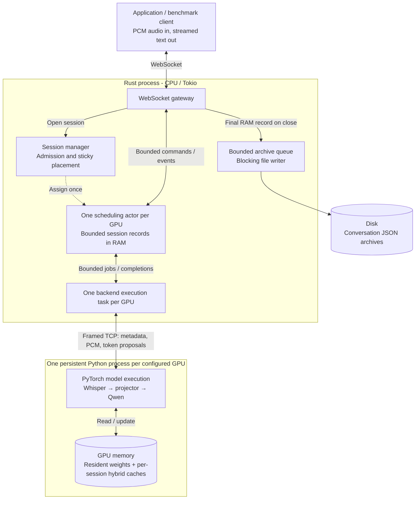
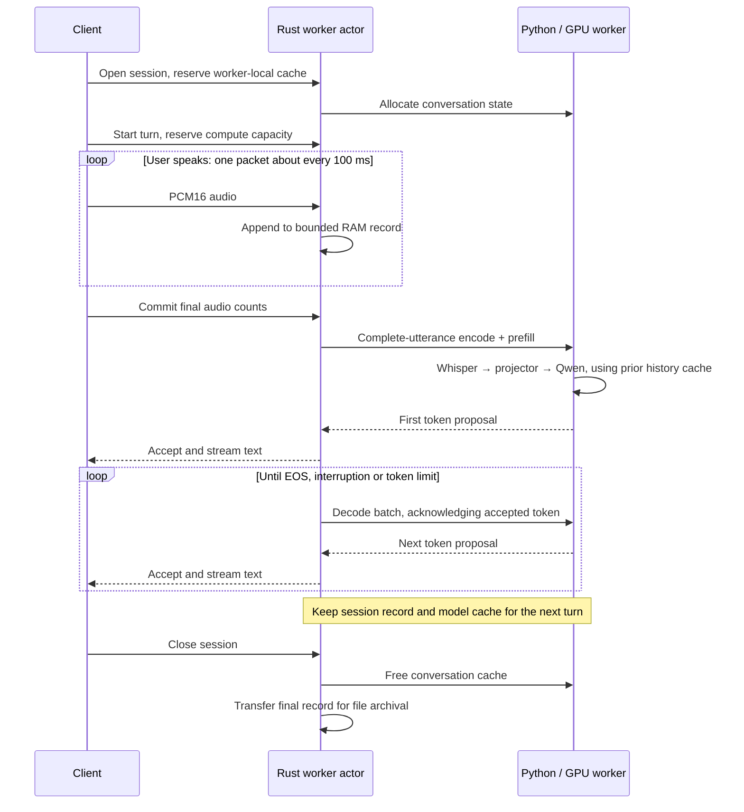

# Turn-based speech inference in Rust

A Rust/Tokio gateway serves persistent speech conversations through ordinary WebSocket connections. Clients send audio, mark the end of a user turn, and receive streamed text. Sessions stay on one GPU worker, retaining their model cache across turns. Rust schedules the work; a persistent PyTorch process per GPU performs real inference.

The model comes from **[speech-llm-projection](https://github.com/BertilBraun/speech-llm-projection)**: a trained projection layer connects frozen Whisper Small to frozen Qwen3.5-2B. Whisper features are pooled into **10 speech embeddings per second**. This repository implements the serving architecture around that model; the linked research project documents training, evaluation and model-quality limitations.

This is a working runtime showcase with real-model RTX 3090 measurements. It streams **text**, with no text-to-speech, built-in VAD, authentication, database or frontend.

## What was built

- A versioned WebSocket gateway accepting session IDs and ordered PCM16 packets, normally every **100 ms**.
- Actor-owned session and scheduling state, bounded channels, explicit backpressure and rejection before accepting an overloaded turn.
- Sticky GPU placement and dynamic prefill/decode batches, using measured forward costs rather than assuming linear batch scaling.
- Persistent multi-turn hybrid caches: attention KV, convolution state and recurrent state.
- Safe interruption: preserve accepted text, stop scheduling the old generation, and discard late proposals by generation ID.
- Bounded RAM conversation records and asynchronous file archives containing original audio, accepted token IDs/text and timing.
- Network workload clients reporting latency percentiles, rolling per-session token rates, admission, batch fill and resource observations.

## Measured on real hardware

The [staggered conversation benchmark](docs/GPU_STEADY_STATE_3090.md) uses one RTX 3090, BF16 serving weights and a real 5.94-second speech recording. Sessions start randomly across **10 seconds**, then cycle through user and assistant turns during a separate **20-second measurement interval**. Clients send 100 ms packets over loopback WebSocket and commit immediately after the final packet. **No speculative preparation or added endpointing delay is used.**

| Persistent conversations | Measured tokens/s | First-token p95 | Refused turn-start attempts during measurement |
| --- | ---: | ---: | ---: |
| 8 | 98.95 | 109 ms | 0 |
| 32 | 249.20 | 203 ms | 212 |

Every session produced text and had complete two-second generation-rate windows above the four-token/second target. At 32 sessions, ten individual token gaps exceeded 250 ms, with a **403 ms maximum**. Clients retained their connection and retried refused turn starts, so the 212 refusals include repeated attempts. First-token latency excludes waiting for admission: this is **not a refusal-free capacity claim** for 32 users.

Rust batch building and completion processing took **13 µs and 17 µs p95** at 32 sessions. Paired backend communication overhead was **0.70 ms p95**, including both Rust and Python framing/transport; Python decode was **28.2 ms p95**. These are measured boundary durations, not a complete Rust CPU profile. The report includes p50/p95/p99/max, admission counts, rate coverage, resource observations and commands. Short trials on repeated audio do not establish sustainable capacity or external-network latency. Model quality is evaluated in the training project.

The earlier [immediate-commit concurrency sweep](docs/GPU_IMMEDIATE_COMMIT_3090.md) used arrivals spread across only 500 ms and preceded the cache optimization below. It remains available as historical burst-like evidence, including the offered-96-session overload cases.

The older [endpoint-preparation experiment](docs/GPU_ENDPOINTING_3090.md) obtained **35.9–42.3 ms post-commit p95** at eight offered sessions by doing inference during an artificial 200 ms confirmation interval. Its **237–242 ms last-audio-to-first-token p95** is the relevant full interval. Those numbers are not the ordinary path's response latency. Historical experiments remain available with their limitations and raw-evidence identities.

A [CPU/CUDA decoder profile](docs/GPU_DECODE_OPTIMIZATION_3090.md) found redundant cache copies and initialization in our PyTorch adapter. Removing them reduced batch-16 direct decode median latency from **39.6 to 26.1 ms** on the same 3090. This measures backend row-steps without audio capture or the gateway; the staggered conversation benchmark includes this optimization.

## How the system fits together



GPU count is configuration, not a constant. Each backend owns its device, model and caches; the Rust actor owns scheduling and output acceptance. There is one forward request in flight per worker. Separate workers can run independently. Physical multi-GPU execution has not yet been benchmarked.

The **[visual architecture guide](docs/ARCHITECTURE.md)** expands this into seven diagrams with code links: data flow, computation, cache/storage ownership, batching, interruption and shutdown.

## What happens during a conversation



**Current audio cannot be incrementally prefetched into a final cache.** Whisper is bidirectional: extending the utterance changes earlier audio representations. Packet arrival therefore buffers audio; the ordinary path encodes and prefills the complete utterance after commit. Prior turns remain cached, so they are not replayed on every response.

An optional `prepare` control computes a complete candidate on a private cache branch and holds its first token until commit. More speech invalidates it. Repeating that on every packet would repeatedly encode and prefill the growing utterance; it is not streaming inference. The current benchmark leaves preparation disabled. A genuinely incremental audio path needs a compatible streaming encoder/model. See [the preparation lifecycle](docs/ENDPOINTING_PREPARATION.md).

## Scheduling and the four-token target

The objective is **at least four accepted model tokens per second per generating session after its first token**. Fast responses run as fast as the scheduler allows. First-token latency is measured separately and currently has no enforced SLA.

Decode selection prioritizes the earliest next-token targets. Prefill uses available slack, with a bounded-wait policy so admitted user turns can make progress. Recent measured batch/context costs drive admission with headroom; a nonpreemptive forward can still cause individual gaps above 250 ms. Reports distinguish those gaps from the rolling two-second token-rate objective.

Three different limits matter: open conversations reserve cache and record space; active turns reserve compute capacity; transport limits bound connections and queues. An idle resident session is not a generator. An open session can still have a new turn refused. Offered concurrency, admitted work and hardware capacity are reported separately.

The workload runner now defaults to random session starts spread over ten seconds. `--measurement-secs 20` keeps a cohort cycling and measures a fixed interval after every session-open attempt completes. The report separates measured traffic from ramp-up and draining. Use `--start-spread-ms 0` explicitly for burst tests; the older 500 ms hardware campaigns above are burst-like workloads, not the new arrival pattern. See [the measurement contract](docs/CLIENT_GUIDE.md#measurements-and-admission).

## Try the pipeline locally

The test fixture exercises the real IPC and WebSocket boundaries without a GPU. It returns deterministic text and charges the full configured duration for each nonempty batch; it supplies no model-quality or GPU-speed evidence.

```powershell
# Terminal 1, from backend/
uv sync --locked
uv run python tests/fixture_worker.py --port 9100 --response-tokens 12 --prefill-ms 20 --decode-ms 12

# Terminal 2, from the repository root
cargo run --release -- serve --runtime-config examples/runtime.json

# Terminal 3, from the repository root
cargo run --release -- benchmark --sessions 1 --turns 2
cargo run --release -- benchmark --sessions 8 --turns 2 --report benchmark-results/local.json
```

For real inference, follow **[backend/README.md](backend/README.md)**: supply a projector checkpoint and its SHA256, configure one worker per GPU, wait for model warmup/readiness, and point [examples/runtime.json](examples/runtime.json) at those endpoints. Model weights use BF16; native recurrent state and accumulation retain FP32 where required by the model. The runtime benchmark used checkpoint step 9,550; the training project's selected quality checkpoint is step 6,775. Checkpoint identity is explicit in every deployment and archive.

Clients connect to `/v1`, send `open` and `start_turn`, send ordered binary audio, then `commit`. The gateway streams `text_delta` and `finished` events. Starting a new admitted turn interrupts generation. **[The client guide](docs/CLIENT_GUIDE.md)** documents wire fields, example commands, configuration, latency definitions and archival behavior. [examples/session.rs](examples/session.rs) shows the Rust client API; [WORKER_PROTOCOL.md](docs/WORKER_PROTOCOL.md) specifies the private Rust/Python boundary.

## Find your way through the code

| Responsibility | Location |
| --- | --- |
| Public node, ingress and session APIs | [src/runtime/](src/runtime/) |
| Admission, placement and conversation records | [src/session/](src/session/) |
| Owned scheduling state, batching, cancellation and token acceptance | [src/worker/](src/worker/) |
| Selection policy and measured cost estimates | [src/scheduler/](src/scheduler/) |
| Canonical public events and typed backend protocol | [src/protocol/](src/protocol/) |
| WebSocket connections, bounded writers and archives | [src/transport/](src/transport/) |
| Workload clients and measurements | [src/simulation/](src/simulation/), [src/metrics/](src/metrics/) |
| PyTorch model, hybrid caches and worker server | [backend/src/voice_worker/](backend/src/voice_worker/) |

The [Rust style guide](docs/RUST_STYLE.md) covers small functions/modules, shallow async control flow, boundary documentation and ownership. [rustfmt.toml](rustfmt.toml) defines formatting. API documentation is available with `cargo doc --no-deps --open`.

```powershell
cargo fmt --all -- --check
cargo clippy --locked --all-targets -- -D warnings
cargo test --locked
cargo test --locked --test transport python_worker_process_to_websocket_client_full_pipeline -- --ignored

# From backend/
uv run ruff format
uv run ruff check --fix
uv run pytest tests tools/test_guard_worker.py -q
```

Ordinary tests cover placement, admission, dynamic batching, full hybrid cache state, interruption, stale results, bounded overload and archive cleanup. The explicit cross-language test starts a Python fixture. CUDA tests require a configured checkpoint and device; the hardware reports state which tests actually ran.

## Documentation and current limits

| Read next | Purpose |
| --- | --- |
| [Visual architecture](docs/ARCHITECTURE.md) | Data movement, computation and cache/storage ownership |
| [Immediate-commit GPU results](docs/GPU_IMMEDIATE_COMMIT_3090.md) | Current ordinary-path latency and offered-concurrency sweep |
| [Client and operating guide](docs/CLIENT_GUIDE.md) | Public protocol, benchmark controls, records and limits |
| [Backend guide](backend/README.md) | Model integration, deployment, cache invariants and GPU tests |
| [Preparation diagrams](docs/ENDPOINTING_PREPARATION.md) | Optional speculative branch and activation semantics |
| [Rust style](docs/RUST_STYLE.md) | Code organization and review conventions |
| [Implementation decisions](docs/IMPLEMENTATION.md), [original plan](PLAN.md) | Design context and documented assumptions |
| [Earlier GPU benchmark](docs/GPU_BENCHMARK_3090.md), [endpointing experiment](docs/GPU_ENDPOINTING_3090.md) | Historical evidence and its limitations |

This prototype does not implement crash recovery, automatic history replay, cache migration, paged allocation or silent context truncation. Hybrid cache join/split currently copies tensors; unequal context lengths require padding. Short repeated-recording trials do not establish sustainable production capacity, general speech quality or external-network latency. [PERFORMANCE.md](PERFORMANCE.md) concerns the superseded audio-echo prototype and does not describe this model's capacity.
