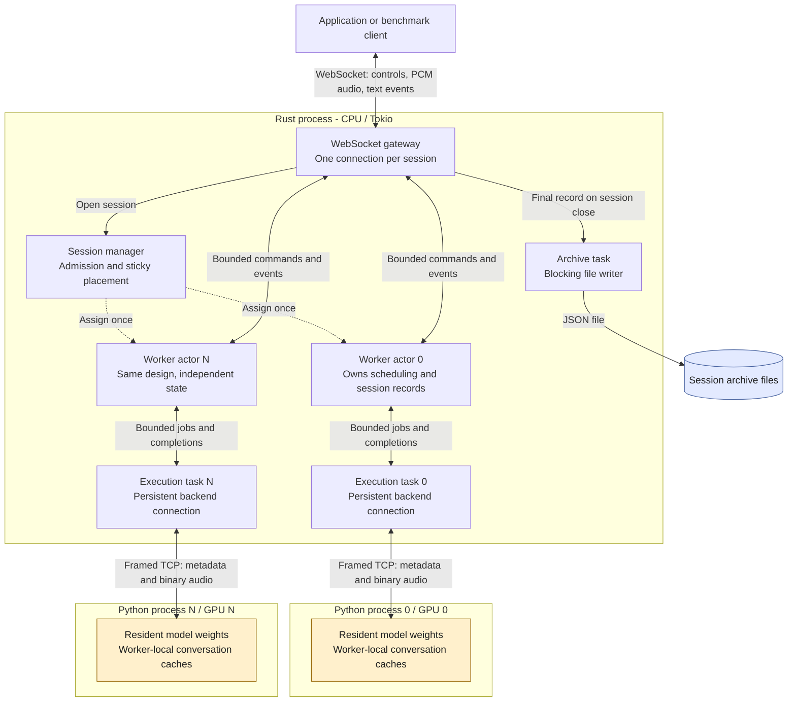
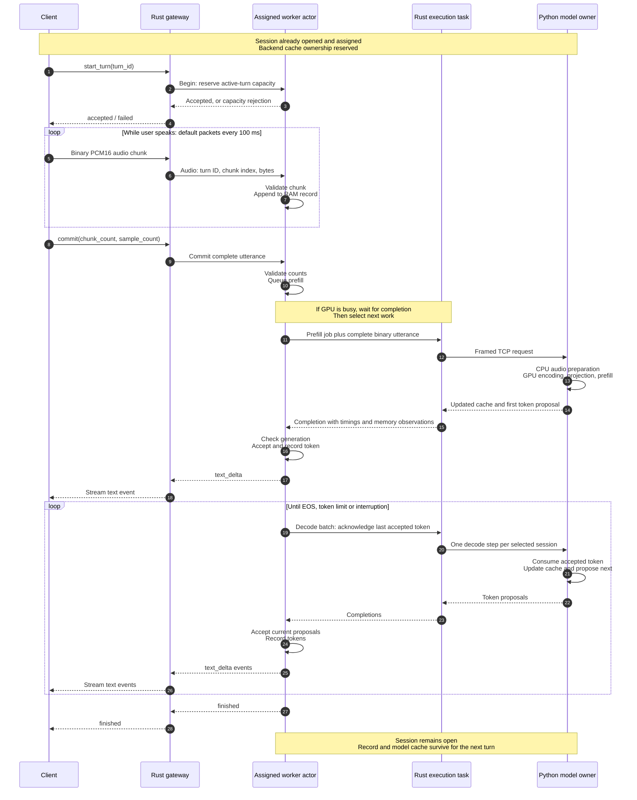
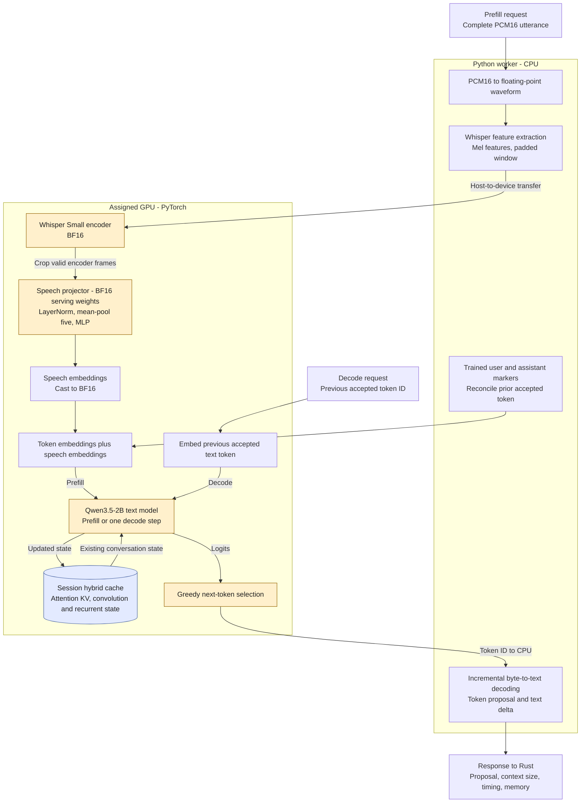
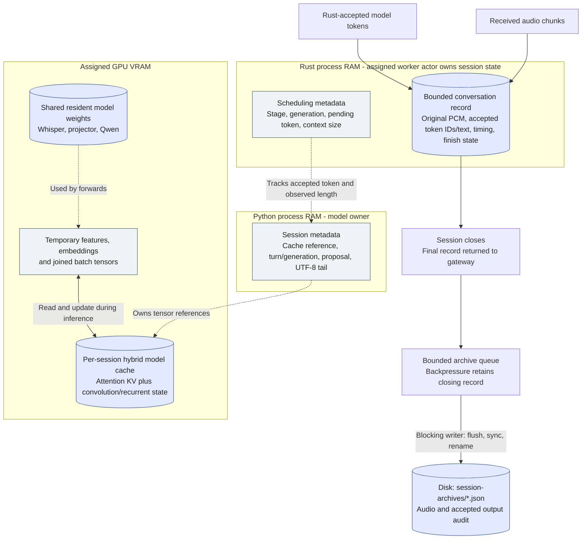
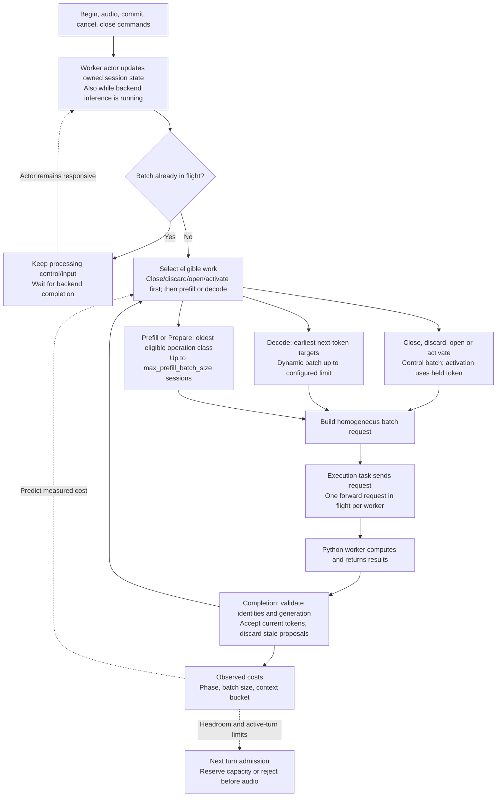
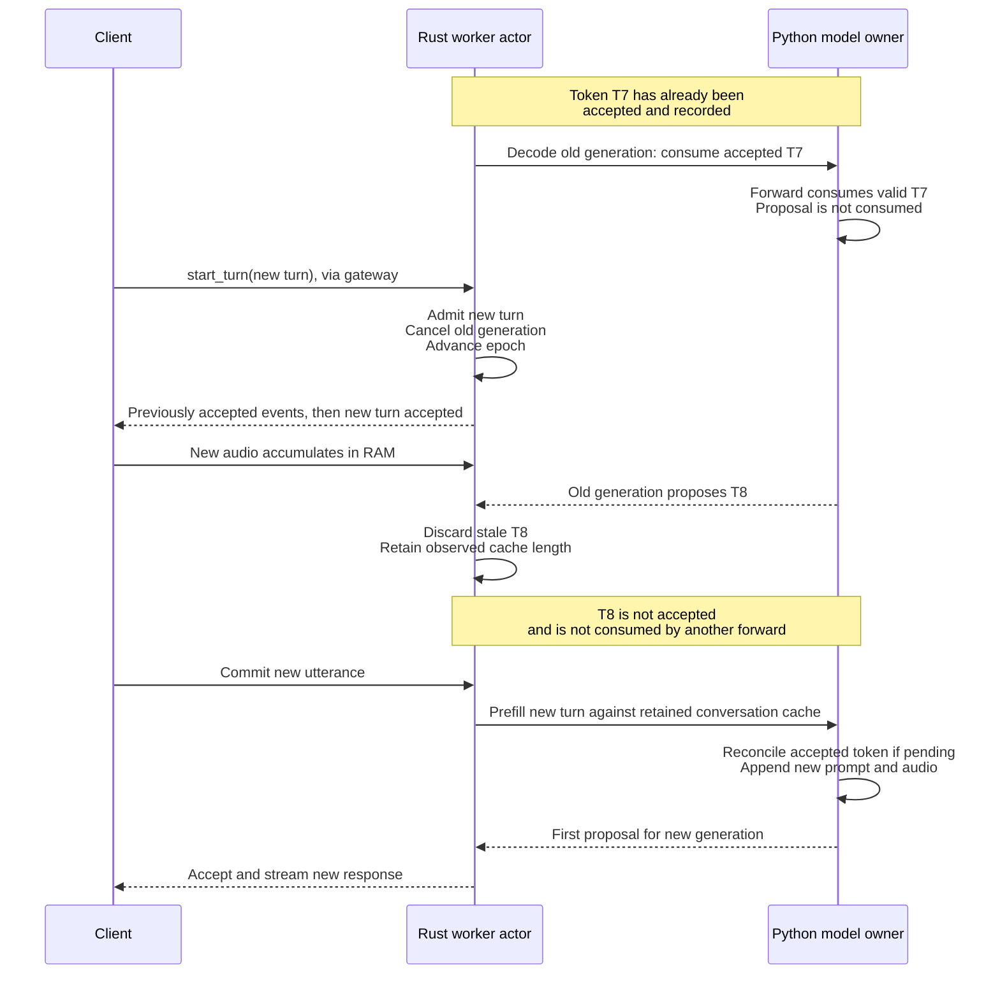
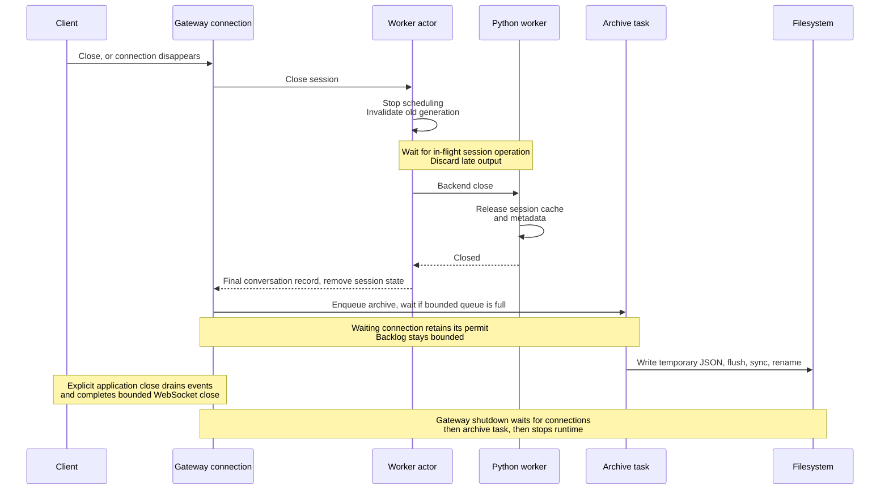

# Visual architecture guide

This project accepts a conversation over WebSocket, collects one user utterance, and streams the model's text response. Rust decides **where and when work runs**. A persistent Python worker performs **model computation and owns the GPU cache**. The same conversation stays on the same worker until it closes.

Read the diagrams in order for a walkthrough, or jump to a question:

| Question | Diagram |
| --- | --- |
| What runs where, and how do the pieces connect? | [1. Whole system](#1-whole-system) |
| What happens to my audio packet and response? | [2. One user turn](#2-one-user-turn) |
| Where does model computation happen? | [3. Inside the model worker](#3-inside-the-model-worker) |
| Where are audio, text, weights and history stored? | [4. Cache and storage ownership](#4-cache-and-storage-ownership) |
| How do multiple conversations share a GPU? | [5. Scheduling and batching](#5-scheduling-and-batching) |
| What happens when the user interrupts? | [6. Interruption](#6-interruption) |
| What is freed or saved at disconnect? | [7. Closing a session](#7-closing-a-session) |

These diagrams describe the current implementation. Start with the [immediate-commit RTX 3090 benchmark](GPU_IMMEDIATE_COMMIT_3090.md) for the ordinary path: continuous 100 ms packets, preparation disabled and no added endpointing delay. The optional [preparation path](ENDPOINTING_PREPARATION.md) computes whole candidates during client endpoint detection; it does not provide incremental Whisper prefill. Model quality belongs to [the training project](https://github.com/BertilBraun/speech-llm-projection). Physical multi-GPU behavior and sustained capacity remain unmeasured. Earlier local tests used a separate synthetic worker; see [those results](LOCAL_VALIDATION.md).

## 1. Whole system

An application and the benchmark client use the same public gateway. Opening a session goes through the session manager, which selects an available worker with the lowest session load. After that, the connection's session handle sends commands directly to its assigned worker actor. The manager is not a relay for every audio packet.

`0` and `N` illustrate repeated workers, not a fixed GPU count. Each Python process loads its own models once and keeps one selected GPU's state resident. Each worker has one batch in flight; separate GPUs can compute concurrently. A session is never routinely migrated or rebalanced.

**Inspect:** [gateway](../src/transport/gateway.rs), [placement](../src/session/manager.rs), [worker actor and execution task](../src/worker/actor.rs), [Python server](../backend/src/voice_worker/server.py).

## 2. One user turn

Audio packets travel over WebSocket while the user speaks. They accumulate in the assigned Rust actor's bounded session record. **No Whisper or language-model forward runs for each incoming packet.** The client sends `commit` when the utterance ends. End-of-turn detection is currently the client's responsibility.

The audio format is mono, little-endian PCM16 at 16 kHz, with a maximum 30-second utterance. The benchmark uses randomly started sessions and 100 ms packets: 1,600 samples / 3,200 PCM bytes each, plus a shorter final packet when needed. The model target is 10 Hz speech embeddings. Transport packet boundaries do not determine embedding boundaries; the complete utterance is encoded at commit. The optional jitter scenario uses 100–110 ms capture intervals.

The diagram shows one session; its decode steps can share batches with other sessions. A model token is not necessarily a word or complete character. EOS is accepted and counted even when its text delta is empty.

**Inspect:** [wire format](../src/transport/wire.rs), [connection handling](../src/transport/connection/mod.rs), [audio accumulation and commit](../src/worker/turn.rs), [token acceptance](../src/worker/output.rs), [worker protocol](WORKER_PROTOCOL.md).

## 3. Inside the model worker

Python has an asynchronous network loop and one model-owner executor thread per worker. The executor performs CPU preparation and launches PyTorch GPU operations; it does not create a thread for each session. The numerical model runs on the selected GPU.

| Phase | What it computes | Where |
| --- | --- | --- |
| Audio preparation | PCM conversion and mel features | Python CPU executor |
| Speech encoding | Whisper hidden states for the complete utterance | GPU |
| Projection | Pool and map Whisper states into the language model's embedding space | GPU |
| Prefill | Append prompt/audio embeddings to existing conversation state; propose the first response token | GPU |
| Decode | Feed the last accepted token through the model; propose one next token per session | GPU |
| Text conversion | Incremental UTF-8 text from the proposed token | Python CPU |
| Scheduling and acceptance | Select work, fence stale results, decide which tokens are committed | Rust CPU actor |

Whisper is bidirectional, so encoding uses a complete candidate waveform rather than permanently appending partial-utterance embeddings. The ordinary path starts at commit. Optional `prepare` starts earlier against an isolated conversation-cache branch and holds its first token privately; matching commit activates it without another forward. Resumed audio discards that branch. See the [preparation diagrams](ENDPOINTING_PREPARATION.md). A text proposal is **not automatically fed back into the model**: Rust must accept it first. Python never runs an independent, uninterruptible response-generation loop.

**Inspect:** [model loading and forwards](../backend/src/voice_worker/model.py), [projector](../backend/src/voice_worker/projector.py), [prefill/decode orchestration](../backend/src/voice_worker/pytorch_engine.py), [detokenization](../backend/src/voice_worker/detokenizer.py).

## 4. Cache and storage ownership

There are two histories with different purposes: **the Rust record lets us inspect what happened; the GPU cache lets the model continue the conversation efficiently.** The record is not consulted for every decode step, and a disk archive is not a serialized GPU cache.

Solid arrows show data movement; dotted arrows show ownership or bookkeeping relationships in this diagram.

| Data | Owner and location | Lifetime |
| --- | --- | --- |
| Session-to-worker route | Rust session manager, RAM | Until session release; recreated on a new open |
| Original audio and accepted outputs | Rust worker actor, bounded RAM record | Whole session, then transferred for archiving |
| Last accepted token awaiting model consumption | Rust worker actor, RAM | Until the next decode/prefill request acknowledges it |
| Pending proposal and detokenizer state | Python model owner, RAM | Until acceptance, interruption or close |
| Attention KV and convolution/recurrent state | Python-owned tensors on the assigned GPU | Across turns, released on close/disconnect or invalidating failure |
| Optional provisional conversation branch and first token | Python model owner; tensor state on the assigned GPU | From preparation until activation or discard; at most one per session, with a separate cache reservation |
| Model weights | Python-owned GPU tensors | Process lifetime; shared by that worker's sessions |
| Batched cache copies and intermediate tensors | Python/PyTorch, mainly GPU | Temporary forward workspace; allocator memory may remain reserved for reuse |
| Session archive | Local filesystem, default `session-archives/` | Persists after session close; no automatic retention/deletion policy |

The cache represents prior audio and consumed assistant tokens without retaining raw audio on the GPU. The latest accepted token can still be pending; it is reconciled before the next forward. Cache joining/splitting currently copies tensors so sessions do not alias one another. The full hybrid state must be retained; attention KV alone is insufficient for this model.

The audit record preserves received audio even if a queued turn is cancelled before model execution. It preserves only accepted text proposals. Records are bounded and never silently truncated. Archiving can be explicitly disabled with `--no-archive`; disk errors remain visible. There is currently **no restart recovery, archive replay or cache migration API**. Losing a Python worker's cache does not cause automatic reprocessing of the archived conversation.

**Inspect:** [Rust session state](../src/session/state.rs), [canonical record types](../src/protocol/mod.rs), [Python session state](../backend/src/voice_worker/session.py), [hybrid cache batching](../backend/src/voice_worker/cache.py), [archive writer](../src/transport/archive.rs).

## 5. Scheduling and batching

A session keeps worker affinity, but batch membership changes at every forward. For example, one decode batch can contain sessions A/B/C, and the next A/C/D. Idle or capturing sessions do not need a decode slot.

The target is at least **four accepted model tokens/second per generating session after its first token**. The scheduler uses a 250 ms next-token target; first-token latency (TTFT) is measured separately. It can run work earlier than the target and does not deliberately pace fast responses at four tokens/second.

Prefill and preparation normally use available decode slack. The policy also considers consecutive decode batches, and admitted work waiting beyond `max_prefill_wait_ms` (default 100 ms) must run. Compatible operations form batches up to `max_prefill_batch_size` (default four, also bounded by the worker's batch limit). Prepare and ordinary Prefill use separate homogeneous requests. A long nonpreemptive forward can therefore cause token-gap violations; the runtime reports them. Admission has separate resident-session/cache limits and active-turn/compute limits, so an open idle session does not imply unlimited simultaneous generation capacity.

Observed costs use conservative recent measurements, with no assumption that a half-filled batch takes half the time. Unknown shapes use conservative estimates. On real hardware these estimates and limits must be tuned from measurements.

**Current pipeline boundary:** the actor receives commands and updates eligibility while inference runs. The next concrete batch request is selected and built after the current completion; there is no second fully prepared GPU batch in flight or a separate background batch builder. Decode tensors are joined by Python when that request executes. Preparation overlaps with external endpoint detection, not with a second forward on the same GPU.

Bounded worker job and completion channels each have capacity one. The ingress, worker commands, session events, socket writer and archive queues also have explicit bounds. Ordinary command saturation rejects work; a slow output consumer stops its own session. Archive saturation waits during bounded connection teardown rather than dropping a record or blocking a GPU scheduler.

**Inspect:** [selection and reactive cost model](../src/scheduler/mod.rs), [turn admission](../src/worker/admission.rs), [actor/execution channels](../src/worker/actor.rs), [batch construction](../src/worker/batch.rs), [timing observations](../src/worker/completion.rs), [runtime configuration](../src/config.rs).

## 6. Interruption

Starting a new accepted user turn interrupts the old response. The old forward may physically finish, but its late proposal must not become accepted output or be fed into another decode. Generation epochs distinguish old work from current work.

This diagram omits transport tasks to emphasize the acceptance order. If T8 was accepted **before** the actor processed interruption, it is retained instead. The acceptance point is successful enqueue onto the bounded session event stream, not the time the client renders text. Already accepted text stays ahead of the new turn's `accepted` event in stream order.

Cancelling a queued prefill removes it from future model work. An already-running prefill may still append the old user input to valid cache history; its late output proposal is discarded. Cancellation does not rewind hybrid model state. If a forward fails and its progress is uncertain, the session is terminated and its cache released rather than silently continued.

**Inspect:** [interrupt state transition](../src/session/state.rs), [begin/cancel handling](../src/worker/turn.rs), [stale completion handling](../src/worker/completion.rs), [pending token reconciliation](../backend/src/voice_worker/session.py).

## 7. Closing a session

Session close, disconnect and gateway shutdown release model state and preserve the final record for archiving. Model weights stay loaded for other sessions.

On ordinary close, backend state is released before the record is transferred. If the backend connection has already failed, cleanup collects the retained Rust record without requiring a successful backend acknowledgement; Python resets all owned session caches when its gateway disconnects. Archive enqueue is not a per-client durability acknowledgement. The archive writer reports saves and disk failures, and graceful gateway shutdown waits for it to drain. Abrupt process or machine loss can still lose in-memory records.

**Inspect:** [session close API](../src/runtime/session.rs), [connection cleanup](../src/transport/connection/cleanup.rs), [gateway drain ordering](../src/transport/gateway.rs), [archive backpressure and file writes](../src/transport/archive.rs), [Python disconnect cleanup](../backend/src/voice_worker/server.py).

## Review the design without reading every module

Use these questions to compare the implementation with the intended product:

- **Input:** Is candidate-based preparation during endpoint detection enough, or should a future encoder support incremental audio? Current Whisper recomputes each complete candidate; changed audio invalidates its provisional branch.
- **Latency:** Is four model tokens/second sufficient, and what TTFT target should be added? The runtime currently reports TTFT without enforcing a service-level TTFT target.
- **History:** Should an already-running cancelled prefill remain part of the model's conversation? Current cancellation preserves its valid cache effects and retains all received audio in the audit.
- **Storage:** Are bounded RAM records plus JSON archives enough? There is no crash recovery or archive replay, and archived PCM integer arrays are larger than binary audio sidecars.
- **Throughput:** Are the bounded prefill batches and reactive admission limits appropriate? Background batch construction and reduced cache-copy overhead remain possible improvements after GPU profiling.

For public wire fields use [CLIENT_GUIDE.md](CLIENT_GUIDE.md), and for the backend boundary use [WORKER_PROTOCOL.md](WORKER_PROTOCOL.md). For configurable limits see [examples/runtime.json](../examples/runtime.json) and [backend/config.example.json](../backend/config.example.json). For tested behavior use [LOCAL_VALIDATION.md](LOCAL_VALIDATION.md) and the [current hardware results](GPU_IMMEDIATE_COMMIT_3090.md); [HARDWARE_VALIDATION.md](HARDWARE_VALIDATION.md) remains the checklist for new deployments.
