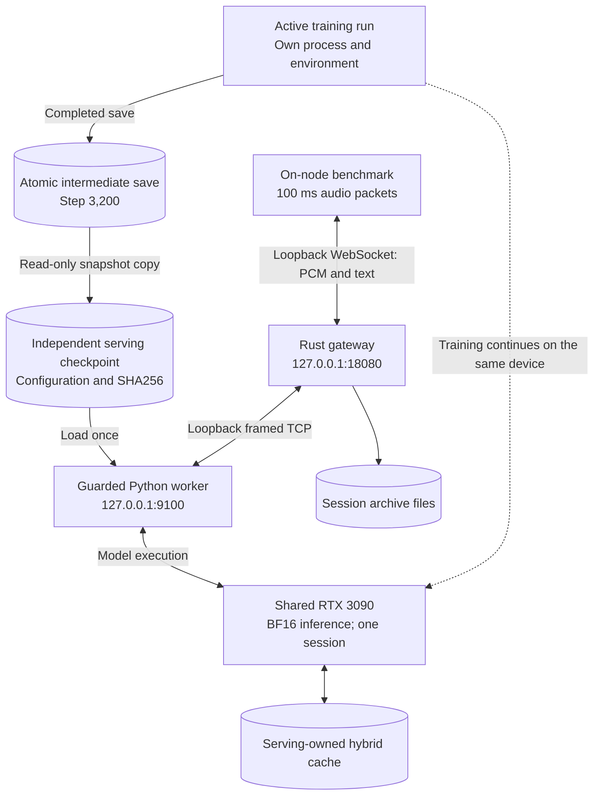

# Preliminary RTX 3090 integration — 2026-10-07

**Historical shared-training run.** The later [idle-node GPU benchmark](GPU_BENCHMARK_3090.md) integrates the completed step-9,550 checkpoint, validates ragged batching and measures multi-session throughput. Its configuration and startup instructions now describe the provisioned service; the smaller limits and results below belong to the earlier smoke run.

The pipeline has run actual Whisper/projector/Qwen inference on the user's rented RTX 3090 while the 10 Hz training run continued. Tests were deliberately small and serial. **Both serving services are stopped after validation**, returning their RAM/VRAM to training. They are provisioned under Supervisor with automatic start/restart disabled.

## Deployment and model identity

- Directory: `/workspace/voice-scheduler-integration-20261007`.
- One RTX 3090, 24,576 MiB; driver `550.107.02`.
- Python 3.12.14, PyTorch 2.6.0+cu124, Transformers 5.13.0, Pydantic 2.13.5; existing flash-linear-attention 0.3.2 and causal-conv1d 1.5.2.
- A separate `.venv` reads existing CUDA packages through system site packages. The serving package and pytest dependencies were installed only into that environment. The training environment, driver, training source and training configuration were not modified.
- Rust 1.99.0 release executable built locally in Ubuntu/WSL with two build jobs and uploaded; no Rust compilation ran on the training node.
- Source run: `/workspace/speech-projector/results_followup_20261007/followup_mean_10hz_epoch1_ce`; copied completed checkpoint at **step 3,200**.
- SHA256: `f842e4c5711c2adc68b18d9568d6ba98e0d433de69971a1b559a55083d282ebe`.
- Snapshot: `checkpoint/projector.safetensors`, `training_state.json`, `training_config.json` and strict `worker.json`. The copy is independent of later training saves. Optimizer state was not copied.
- Pinned Qwen/Whisper revisions match the handoff and the existing cached snapshots. Model downloads were disabled during serving.

Encoder, language-model and projector serving weights use BF16. The copied projector artifact remains the original FP32 training save; loading casts its parameters. Higher-precision accumulation and Qwen's FP32 recurrent state remain where the implementation requires them. The final retrained checkpoint is still to be selected and integrated.



## Resource limits and observations

The serving configuration permits one session, one active turn, batch size one, context 2,048, a 128 MiB cache budget and 512 MiB workspace reserve. The Rust smoke configuration caps responses at 16 tokens, utterances at ten seconds and history at 2 MiB. These are validation limits, not measured capacity recommendations.

`allocator_memory_fraction=0.25` limits the inference process's PyTorch allocator to approximately 6 GiB. Admission and batch workspace checks respect both physical free memory and remaining allocator quota. A separate low-priority guard stops only its owned inference child below 4 GiB free VRAM or available RAM, or above 6 GiB child RSS. It samples every two seconds, so it is not an instantaneous resource guarantee. See [tool limitations](../backend/tools/README.md).

Across the serving runs, sampled child RSS reached **2,214 MiB**, free VRAM stayed at least **11,063 MiB**, and estimated available RAM stayed at least **13,885 MiB**. Compared with the training-only snapshot, serving added about **4.4 GiB VRAM**. These are sampled observations, not allocation high-water measurements. Reported container RAM usage included substantial reclaimable file cache; the guard accounted for the cgroup limit and inactive file cache.

During the GPU tests, training retained PID `180526`, stayed running and continued advancing. No training process was stopped or restarted. The container memory-limit failure counter stayed zero. After serving stopped, the GPU returned to approximately 8,734 MiB used / 15,520 MiB free. At the final deployment check, training had completed its full pass naturally at step **4,775**, with Supervisor reporting exit status **0** at 09:53:39 UTC (11:53:39 Berlin). Follow-up evaluation was running in its own process. Serving remains pinned to the preliminary step-3,200 snapshot. GPU contention during inference is still possible on a shared device; these short tests do not establish isolated serving performance.

## Verified behavior

One real-model CUDA cache test compared two synthetic audio turns with full replay. Its original 0.1 absolute logit tolerance failed, with observed native cached/replayed differences of 0.1875 and 0.198. Diagnosis established that **our cached logits matched Transformers' native cached logits exactly**, and cached/native/replayed paths all chose token 9419. The final test retains exact native-cache comparison, checks the replayed greedy token and uses a documented BF16 replay bound of `atol=0.25, rtol=0.03`. It passed. This is one fixed correctness case, not a broad model-quality evaluation.

The installed FLA library emitted a format-heuristic warning for the 13-position warmup prompt because it is shorter than the 16-head dimension. The warning was preserved; the exact native-cache comparison passed. Ragged multi-session GPU batching remains untested in this shared-node run.

Actual speech came from `index_beams3/audio/appointment_neutral.wav`, resampled from 22,050 Hz mono PCM16 to 16 kHz using one-thread ffmpeg. The resulting file contains 190,218 bytes, about 5.94 seconds of audio. Ordinary clients ran **on the node**, using loopback WebSocket and backend TCP. There was no remote network path; local transport and protocol overhead are included.

| Run | Result | First-token latency | Subsequent token gaps |
| --- | --- | --- | --- |
| Real speech, two turns | 1 session, 2 accepted turns, 32 tokens, no failure/rejection; both responses hit the 16-token cap | 766–1,374 ms | p50 30.4 ms, max 34.0 ms |
| Interruption, two turns | 2 turns cancelled after 2 accepted tokens each; 4 total tokens; next-turn continuation succeeded | 63–127 ms | p50 22.9 ms, max 25.1 ms |
| Final allocator-aware admission, one speech turn | 16 tokens, token limit, no failure/rejection | 606.7 ms | p50 24.1 ms, max 28.4 ms |

Three conversation archives were saved. A local audit verified **all five turns' original PCM bytes exactly**, all **52 accepted tokens** and contiguous token indices. Cancelled turns retained two tokens each. Short responses did not span the two-second rolling-rate window, so these runs cannot claim sustained compliance with the four-token/second objective. Their zero observed 250 ms token-gap violations are recorded separately. Speech grounding/quality, uncapped responses and the final checkpoint were not evaluated.

Initial Supervisor group signalling also stopped the logging helper before it retained the GPU gateway's shutdown summary. The gateway configuration now signals only its main process on SIGINT, leaving the logger to drain; a separate CPU fixture confirmed the complete shutdown report is retained and the fixture exits. That fixture's empty runtime report is not GPU performance evidence.

## Start and test the provisioned service

On the node:

```bash
supervisorctl start voice-scheduler-worker
# Wait until this shows 9100 listening; warmup finishes before the socket opens.
ss -ltn | grep ':9100 '
supervisorctl start voice-scheduler-gateway
cd /workspace/voice-scheduler-integration-20261007
./voice-scheduler benchmark --url ws://127.0.0.1:18080/v1 \
  --sessions 1 --turns 2 --audio-file appointment.pcm \
  --start-spread-ms 0 --report speech-validation.json
supervisorctl stop voice-scheduler-gateway
supervisorctl stop voice-scheduler-worker
```

If startup is still warming, wait for the listening socket before starting the gateway. Inspect `worker.log`, `worker-resources.jsonl` and `gateway.log`. An allocator/guard stop should be investigated before restarting; automatic restart is intentionally disabled. Port 8080 belongs to the existing Jupyter service and was left alone. For an application on your own machine, change the tunnel's remote target:

```powershell
ssh -i 'C:\Users\berti\.ssh\vast-ssh' -p 11316 root@91.150.160.38 -L 8080:127.0.0.1:18080
```

Then connect to `ws://127.0.0.1:8080/v1`. No public gateway port was exposed.

Raw reports, resource logs, original test PCM, the intermediate checkpoint and archives were copied locally to ignored `benchmark-results/3090-integration-20261007/`. The remote directory is ordinary container storage and should not be assumed to survive instance destruction. Final-checkpoint replacement should create a new snapshot/configuration and verify its digest; it must not point serving at the trainer's changing checkpoint file.

Remaining work is final-checkpoint/audio-reference parity and quality evaluation, long-context/uncapped generation, real multi-session/ragged batching, multi-GPU isolation and a sustained capacity sweep after training resources are available. [HARDWARE_VALIDATION.md](HARDWARE_VALIDATION.md) remains the full checklist. Local code validation passed Ruff format/check and 57 CPU tests, with two CUDA tests normally skipped; the single CUDA cache test above was run explicitly on this node.
