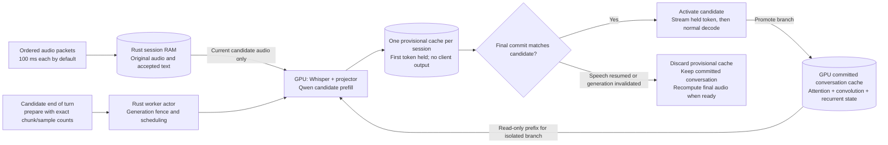

# Preparation during end-of-turn detection

The gateway accepts a provisional `prepare` signal before the definitive `commit`. A client or endpoint detector sends it after a candidate utterance has arrived, while deciding whether the speaker has finished. The worker can encode that complete candidate, prefill the language model and hold its first response token during the confirmation interval. This overlaps computation with endpointing; it does not make Whisper a streaming encoder.

## Data and cache ownership



The backend owns all GPU state. Preparation must preserve the existing committed conversation byte-for-byte: no attention tensor, convolution state, recurrent state, accepted-token bookkeeping or pending UTF-8 text is updated by a provisional forward. Only successful activation replaces the canonical conversation state. No provisional token enters Rust's accepted output record or reaches a client.

The worker keeps at most one provisional branch per session, within explicit cache and workspace budgets. Replacing, discarding, cancelling or closing releases it. A generation fence prevents a result already running on the GPU from becoming the next turn's response.

## Normal and resumed-speech paths

```mermaid
sequenceDiagram
    participant C as Client / endpoint detector
    participant G as Rust gateway and actor
    participant P as Python GPU worker
    C->>G: start_turn and ordered audio
    C->>G: prepare(turn_id, chunk_count, sample_count)
    G->>P: Prepare(candidate audio, generation, accepted prefix)
    Note over C,P: Endpoint detection continues while preparation runs
    P-->>G: Candidate ready; first token remains private
    alt Utterance confirmed unchanged
        C->>G: commit(same counts)
        G->>P: Activate(matching turn and generation)
        P-->>G: Held first-token proposal; no new GPU forward
        G-->>C: Accepted first text token
        G->>P: Normal cached decode steps
    else More audio arrives
        C->>G: Next ordered audio packet
        G->>G: Invalidate candidate generation
        G->>P: DiscardPrepared after any running operation returns
        Note over P: Committed conversation stays unchanged
        C->>G: New prepare or final commit
        G->>P: Recompute from complete updated audio
    end
```

A commit arriving while valid preparation is still running waits for that same work; it does not duplicate the prefill. A commit with no valid preparation uses the ordinary complete-utterance path. The optional optimization must leave that path usable after a preparation failure.

## Public protocol and timing

`prepare` includes the current turn ID, exact accepted chunk count and exact sample count, just like commit's completeness check. It acknowledges a candidate, not the end of a turn. Audio can continue afterward; commit remains the authoritative boundary. A ready notification carries candidate counts and no text. Clients must treat notifications for older counts as obsolete after resumed speech.

The prototype does not perform voice activity detection. The application supplies the candidate and final end-of-turn decisions. Benchmarks simulate a configurable confirmation interval, comparing preparation enabled and disabled with the **same interval**. Both use actual WebSocket controls; they must not wait for preparation readiness before starting the configured confirmation timer.

Reported time to first token starts at final commit. The confirmation interval and preparation work happen before that measurement. Lower commit-to-first-token latency does not erase capture or endpointing time from conversational latency. If the candidate is ready, activation requires only control processing and can still wait for the current GPU batch to finish. If it is not ready, its remaining preparation and queue time remain visible.

The optimization relies on a stable candidate waveform during the confirmation interval. Continuing to append silence packets changes that waveform and invalidates the candidate, just as resumed speech does. A caller should freeze the candidate at its chosen audio boundary and report subsequent speech as new packets when needed.

## Validation requirements

- Compare prepared/activated first tokens and hybrid caches with ordinary prefill, including multi-turn accepted-token reconciliation.
- Verify no provisional text is emitted or archived before final commit.
- Append audio while preparation is queued, running and ready; verify the updated utterance is processed once and obsolete results are fenced.
- Interrupt, close and start a new turn while preparation or activation is running.
- Exercise duplicate candidate requests, mismatched counts, cache-budget refusal and preparation failure with a healthy fallback.
- Measure both commit-to-first-token and the visible endpointing interval under identical traffic. Retain per-session generation rates, rejections, archives and memory observations.

Implementation and hardware measurements are added after these checks pass.
