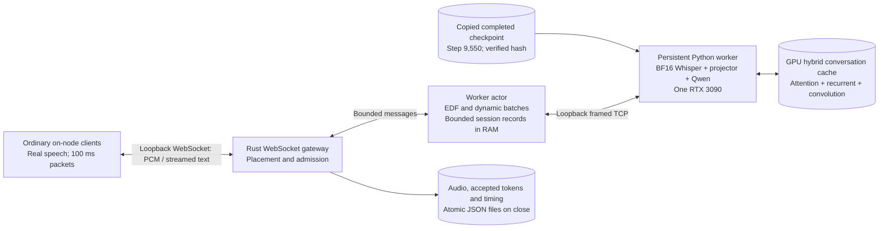

# Real-model RTX 3090 validation — 2026-10-07

The turn-based pipeline passed real-model GPU tests and on-node WebSocket workloads after training and evaluation finished. Across 14 workloads, 212 sessions were admitted, 221 turns committed and 20,689 tokens returned and archived. There were no failed sessions, backend failures or archive failures. Sixteen turns were deliberately interrupted.

This establishes an operational pipeline on one RTX 3090. It does **not** establish a production capacity limit or model quality. At 32 offered sessions the two runs measured **163.6 and 148.3 aggregate model tokens/s**, with active-turn rejections. Thirty-two resident sessions are not thirty-two simultaneously generating sessions.

## Hardware, checkpoint and configuration

- One RTX 3090, 24,576 MiB nominal VRAM, driver 550.107.02; AMD Ryzen 5 5600X, 12 logical CPUs; container memory limit 48,412,753,920 bytes.
- Python 3.12.14, PyTorch 2.6.0+cu124, Transformers 5.13.0, flash-linear-attention 0.3.2 and causal-conv1d 1.5.2. The existing CUDA environment and training artifacts were unchanged.
- Completed run: `/workspace/speech-projector/results_followup_20261007/followup_mean_10hz_ce_control_9550`, step **9,550**, epoch 2, 76,386 examples seen. Its configuration confirms mean pooling by five, Whisper Small, MLP 768 → 1,024 → 2,048 and Qwen3.5-2B.
- Independent snapshot: `/workspace/voice-scheduler-integration-20261007/checkpoint-9550`. Projector SHA256: `8a1d62c7a8a13e430705c828605805181784603aa6f3d266024152df266c64c7`.
- Qwen revision `15852e8c16360a2fea060d615a32b45270f8a8fc`; Whisper revision `973afd24965f72e36ca33b3055d56a652f456b4d`. Greedy decoding, trained chat markers and empty thinking block; BF16 encoder, projector and LM weights. Native FP32 recurrent state remains required.
- Runtime source `3c8172c`; Rust release executable unchanged from `752fdde`, whose Rust sources match it. Python test/guard corrections are committed in `6232eea` and `9ae579d`; serving model and scheduler behavior were unchanged during the sweep.

| Limit | Value |
| --- | --- |
| Resident sessions per worker | 64 |
| Active turns per worker | At most 32; reactive admission can reject earlier |
| Decode batch limit | 16 |
| Conversation context | 2,048 model positions |
| Response limit | 256 model tokens; normal EOS was respected |
| Audio limit | 10 seconds per turn |
| Session record limit | 2 MiB |
| Worker cache budget / workspace reserve | 4 GiB / 2 GiB |
| PyTorch allocator quota | 75% of device memory |
| Rust mailbox / event capacities | 128 / 128 |
| Gateway connection limit | 128 |
| Token target / admission headroom | 4 tokens/s / 80% |
| Unknown forward estimate / maximum prefill wait | 100 ms / 2,000 ms |

The resource guard retained 4 GiB free VRAM and available RAM thresholds and a 6 GiB worker RSS limit, with two-second sampling. The quota caps PyTorch allocator memory, not every CUDA-library allocation. These bounded test settings are not capacity recommendations.

## What was exercised



All inference used actual model weights. Input was the same 5.94-second appointment speech recording in each turn: 190,218 bytes of mono PCM16 at 16 kHz. Default packets carried 100 ms, with an exact final tail. Complete-utterance Whisper computation ran at commit; accepted text and audio context continued in the hybrid cache between turns.

Clients used loopback WebSocket and backend TCP. Local protocol, scheduling and transport overhead are included; external networking and end-of-turn detection are absent. Session starts were independently randomized over 500 ms, with 250 ms think time. Unless noted otherwise, each client attempted two turns. A capacity rejection ended that client's conversation, so later turns were not retried or counted as attempts.

## Load sweep

These are sequential runs in one gateway lifetime after the initial cold runs. The cost model continued learning batch/context shapes between rows. The word “warm” in raw filenames identifies this second service lifetime; it does not mean every shape was already warmed. All admitted turns in this table completed normally, without hitting the response token limit.

| Offered sessions | Resident sessions admitted | Turns admitted / rejected | Returned tokens | Wall-clock tokens/s | TTFT p50 / p95 / p99 / max, ms | Token gap p50 / p95 / p99 / max, ms | Gaps >250 ms |
| --- | --- | --- | --- | --- | --- | --- | --- |
| 1 | 1 | 2 / 0 | 239 | 12.9 | 372 / 702 / 702 / 702 | 21.6 / 21.9 / 22.4 / 30.4 | 0 |
| 4 | 4 | 6 / 2 | 536 | 25.5 | 1,835 / 2,057 / 2,057 / 2,057 | 22.1 / 25.8 / 27.5 / 73.4 | 0 |
| 8 | 8 | 10 / 6 | 813 | 36.8 | 2,054 / 2,253 / 2,253 / 2,253 | 30.9 / 31.3 / 256.3 / 303.4 | 10 |
| 16 | 16 | 26 / 4 | 3,008 | 110.4 | 2,154 / 2,464 / 2,513 / 2,513 | 37.2 / 39.1 / 220.7 / 724.5 | 19 |
| 32 | 32 | 47 / 11 | 4,823 | 163.6 | 723 / 2,310 / 2,390 / 2,390 | 43.5 / 95.9 / 266.0 / 790.5 | 59 |
| 32, later repeat | 32 | 32 / 16 | 3,569 | 148.3 | 332 / 1,112 / 1,312 / 1,312 | 42.6 / 78.8 / 136.1 / 175.0 | 0 |
| 80, aligned, one turn | 64; 16 opens rejected | 16 / 48 | 1,328 | 120.4 | 740 / 1,862 / 1,862 / 1,862 | 42.4 / 82.0 / 136.4 / 180.2 | 0 |

Wall-clock throughput is received model tokens divided by the full workload duration, including capture, think time, startup spread and rejected work. It is not decoder-only GPU throughput. TTFT starts at commit and includes queued prefill work; audio capture time precedes it.

No session fell below four tokens/s in an observed **two-second rolling generation window**. The worst observed rolling rate was **7 tokens/s** in the first 32-session run. A window is measured only after two seconds from the first token; short responses and the two-token interruption test cannot establish sustained throughput. Across all 14 workloads, 126 session executions had an observed window. Individual 250 ms gap misses remain visible: the longest was **791 ms**. Meeting the rolling target therefore does not guarantee smooth token spacing or a first-token latency target.

## Other workloads, after the sweep

| Scenario | Result | Wall tokens/s | TTFT p50 / p95 / p99 / max, ms | Gap p50 / p95 / p99 / max, ms |
| --- | --- | --- | --- | --- |
| Eight aligned starts, two turns | 16 completed; no rejections | 78.4 | 206 / 729 / 729 / 729 | 32.2 / 33.3 / 119.6 / 173.6 |
| Eight random starts, 100–110 ms packets | 16 completed; no rejections | 91.2 | 115 / 355 / 355 / 355 | 32.3 / 32.7 / 79.1 / 174.8 |
| Eight clients × three churn rounds, one turn each | 24 completed; all slots reusable | 66.2 | 79 / 154 / 191 / 191 | 32.2 / 33.0 / 126.1 / 172.5 |
| Eight clients, two turns, cancel after two tokens | 16 interrupted; 32 tokens returned | 2.5 | 89 / 187 / 187 / 187 | 70.7 / 242.6 / 242.6 / 242.6 |

No failed sessions or gap misses occurred in these four cases. Lower latency in later cases reflects learning/warmup as well as load differences; this sequence does not establish that aligned or jittered traffic is intrinsically faster.

The second gateway lifetime recorded 2,984 decode batches with a mean **6.53 sessions per batch**, or **40.8%** of its 16-slot limit. Completed device stage p50/p95/p99/max were: encode **8.3/9.1/12.7/21.5 ms**, prefill **31.5/35.0/103.3/685.6 ms**, decode **29.3/40.2/43.5/225.8 ms**. Stage timers can include device idle time between host launches; their percentiles cannot be added to reconstruct client latency.

Worker RPC busy time was 104.0 seconds across a 531.7-second gateway lifetime, including pauses between experiments. Its reported 19.6% utilization is a service-lifetime busy ratio, **not** saturated GPU utilization. No SM utilization or kernel profile was collected.

## Correctness, archives and resource cleanup

The final on-node command was:

```bash
PYTHONPATH=backend/src HF_HOME=/workspace/.hf_home HF_HUB_OFFLINE=1 \
TRANSFORMERS_OFFLINE=1 VOICE_WORKER_CONFIG=checkpoint-9550/worker.json \
OMP_NUM_THREADS=1 TORCHINDUCTOR_COMPILE_THREADS=1 \
TRITON_CACHE_DIR=/workspace/voice-scheduler-integration-20261007/triton-cache \
.venv/bin/python backend/tools/guard_worker.py \
  --report gpu-final-resources.jsonl --minimum-free-vram-mib 4096 \
  --minimum-available-ram-mib 4096 --maximum-child-rss-mib 6144 -- \
  .venv/bin/python -m pytest backend/tests backend/tools/test_guard_worker.py -q
```

**65 tests passed**, including native-cache/multi-turn replay and ragged GPU decode followed by split-cache continuation. The native cached comparison remains exact. BF16 serial/batched and cached/replayed comparisons use `atol=0.25, rtol=0.03` and require equal greedy tokens in these cases. A diagnosis on the preliminary checkpoint found up to 0.203 logit difference in native equal-length BF16 batching, supporting the numerical bound; this is not a universal guarantee of identical outputs near ties. FLA emitted its existing short-sequence format heuristic warning during warmup.

CPU fixtures were corrected to choose reference convolution, recurrence and normalization kernels even when GPU extensions are installed. The Linux resource guard was corrected to preserve a child's exit status when the process exits during `/proc` sampling. Six tests cover that race. Both changes are confined to test/operator code.

Local validation also passed: `cargo test --locked` (47 tests), the explicitly enabled cross-language pipeline test, `cargo fmt --check`, `cargo clippy --locked --all-targets -- -D warnings`, `uv run ruff format`, `uv run ruff check --fix`, and `uv run pytest tests tools/test_guard_worker.py -q` (63 passed, two CUDA tests skipped locally).

An audit of **all 212 archive files** verified exact original PCM for all 221 committed turns, contiguous token indices and monotonic timings. Their 20,689 accepted tokens exactly matched client totals; all 16 cancelled turns were recorded. Each archive belonged to worker zero and the same model identity. The two gateway reports had zero archive failures. The second lifetime recorded **40 bounded archive backpressure events**, no rejected archives, **eight discarded stale results**, zero backend failures and zero active sessions after cleanup.

Across 377 serving/final-test resource samples, child RSS reached **2,250 MiB**, free VRAM stayed at least **19,240 MiB**, and available container RAM stayed at least **38,439 MiB**. These are sampled bounds, not exact allocation peaks. The container memory-limit failure counter remained zero. After both services stopped and the final tests exited, the GPU reported **32 MiB used**, **24,222 MiB free**, and no compute processes.

## Reproduce and inspect

Both Supervisor services are provisioned but **stopped**, with automatic start/restart disabled. Their wrappers now select `checkpoint-9550/worker.json` and `throughput-results/runtime.json`, with the limits above. The private gateway remains `127.0.0.1:18080`; backend IPC is `127.0.0.1:9100`. The existing Jupyter listener on 8080 is unchanged.

Start the worker, wait for its warmup and listening port, then start the gateway:

```bash
supervisorctl start voice-scheduler-worker
ss -ltn 'sport = :9100'
supervisorctl start voice-scheduler-gateway
cd /workspace/voice-scheduler-integration-20261007
./voice-scheduler benchmark --url ws://127.0.0.1:18080/v1 \
  --sessions 8 --turns 2 --audio-file appointment.pcm \
  --report throughput-results/new-run.json
supervisorctl stop voice-scheduler-gateway
supervisorctl stop voice-scheduler-worker
```

Port inspection is not a wait loop: start the gateway only once the worker is listening. First queries of new batch/context shapes can still incur compilation; do not interpret a cold refusal as measured hardware capacity. Preserve gateway shutdown reports before another start rotates their logs.

Raw reports, both gateway summaries, every archive, resource samples, failure/final test logs and the checkpoint snapshot were copied to `benchmark-results/3090-throughput-20261007/` locally. The compressed evidence SHA256 is `bb750529f043e013b524eccedb6f3678196c5f6c74bd7238891148921c79d383`. Results and checkpoints are ignored by Git; this document preserves the measured values. Remote evidence lives under `/workspace/voice-scheduler-integration-20261007`, which must be copied out before destroying the instance.

## Remaining work

1. Improve representative startup warmup and calibrate cold compilation separately from steady-state admission. Conservative recent maxima and unknown-context estimates currently cause avoidable refusals and up to about 2.5 seconds TTFT. The sweep does not show the GPU's maximum decode throughput.
2. Run longer, repeated mixed workloads: distinct speech, longer conversations, variable response lengths, overlapping end-of-turn bursts and realistic think times. The two 32-session runs admitted different numbers of turns; they cannot justify a fixed concurrent-generation capacity promise.
3. Validate quality and preprocessing/output parity against the selected training reference. The completed checkpoint is integrated; runtime success is independent of whether it is the final quality selection.
4. Validate actual multi-GPU deployment and sticky locality across devices. Only one physical GPU was available. Local fake-worker tests cover placement, slowdown, bounded-channel saturation and slow consumers; those fault scenarios still need hardware exercises.
5. Measure an external client/network path and actual endpointing before claiming conversational end-to-end latency. TTS and voice output remain outside this project.
