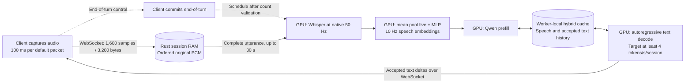

# Model integration status — 2026-10-07

The real PyTorch adapter now passes a preliminary [RTX 3090 integration check](DEPLOYMENT_3090.md) using a copied step-3,200 checkpoint from the active 10 Hz run. The training project was checked locally at revision `46ed242`; its mean-pool-five architecture matches the serving adapter. Final-checkpoint selection remains pending. The archived 2.5 Hz research selection is superseded for this deployment.

## Architecture comparison

| Component | Training reference | Serving adapter |
| --- | --- | --- |
| Audio | Mono 16 kHz | PCM16, mono 16 kHz; complete utterance at commit |
| Encoder | Whisper Small, width 768, native 50 Hz | Whisper Small, BF16 |
| Projector | FP32 LayerNorm, mean pool by five, MLP 768 → 1,024 → 2,048 | Same architecture, BF16 serving weights; 10 speech embeddings/second |
| Language model | Qwen3.5-2B | Pinned Qwen3.5-2B text backbone, BF16 |
| Prompt | Chat without system message; empty thinking block | Matching user/assistant delimiters; startup verifies token IDs |
| Decoding | Greedy | Greedy one-step proposals accepted by Rust |
| History | Reference configuration limits earlier text; serving target retains speech/text | Persistent attention, convolution and recurrent state; one native-cache/replay case checked on CUDA, broader validation pending |

The research reference is `results_preview/overnight_40k_20261007/replay/speech-projector/results_overnight_20261006/overnight_mean_10hz/config.json`. Its preview checkpoint was loaded into `SpeechProjector` on CPU with strict state-dictionary validation: all names and shapes matched. SHA256: `3e8eb8d7cb446a8f0124496ef28b03c213c9bc1f1de78876ff2a03edfdb2821a`. This checks parameter compatibility only. It is not the selected final retraining checkpoint, and no CUDA inference or output parity was tested.

`backend/config.example.json` still names the earlier `teacher_20000_mlp_10hz` checkpoint and its hash. It is a deployment example, not the final trained artifact. When the final checkpoint is available, verify its accompanying configuration, compute its hash and configure each worker with that exact identity. Do not substitute the saved 2.5 Hz checkpoint: its tensor shapes can match while its pooling semantics differ.

## Capture and computation

Packets are not separate prefill jobs. Whisper is bidirectional, so the backend encodes the complete utterance after commit. A one-second utterance normally travels as ten packets and produces ten speech embeddings; partial utterances use the projector's partial-block rule. The gateway accepts a short final packet and validates exact counts, without imposing a wall-clock arrival frequency. The jitter benchmark varies capture intervals between 100 and 110 ms; packet size follows the interval, without changing model pooling.

## Hardware experiment and remaining work

The later [RTX 3090 deployment](DEPLOYMENT_3090.md) records actual CUDA checks and gateway requests using a copied intermediate checkpoint from the active 10 Hz run. The earlier CPU-only checks and pending-final-checkpoint status below are retained as the initial integration record; they do not describe the later smoke deployment as untested.

The immediate goal is a correctness showcase: actual audio in, streamed text out, multi-turn cache continuation, interruption and independent sessions. There is no initial concurrency target; establish working model inference before buying throughput. Start with one RTX 3090 on Linux for its 24 GB memory headroom, then validate two workers on a multi-GPU host. GPU count is configurable. Each GPU holds its own full model replica and conversation caches, and the Rust gateway shares the host. Device memories are separate; session placement does not pool them.

Two 12 GB RTX 3060s are a possible lower-cost multi-worker experiment, subject to current rental offers and measured model/workspace memory. They require limits sized for their smaller memory, rather than copying the current deployment example unchanged. Neither their feasibility nor their response latency has been validated. The memory specifications are from [NVIDIA's RTX 3090 page](https://www.nvidia.com/en-eu/geforce/graphics-cards/30-series/rtx-3090/) and [RTX 3060 announcement](https://nvidianews.nvidia.com/news/nvidia-introduces-geforce-rtx-3060-next-generation-of-the-worlds-most-popular-gpu/). A faster GPU may improve forward time; complete response latency also includes utterance processing, queueing, cache manipulation and transport.

The provided one-GPU node is provisioned in a separate serving directory and environment, with small resource limits. Its PyTorch 2.6.0+cu124/Transformers 5.13.0 stack and existing fast kernels passed the limited check documented above. The backend also supports the pure PyTorch linear-attention fallback. Neither this check nor the current rental establishes sustainable session capacity or general fast-kernel performance across hardware.

Remaining gates:

1. Receive the final 10 Hz checkpoint and configuration; verify architecture, model revisions and hash.
2. Extend the existing one-GPU deployment to multi-worker hardware when that experiment is needed.
3. Complete audio-reference/projector parity and broader cache/batching checks; preliminary CUDA cache continuation and gateway interruption now pass.
4. Profile encode/prefill/decode, cache join/split, CPU preparation, VRAM and end-of-turn-to-first-token latency.
5. Ramp realistic concurrent conversations and tune reactive admission against per-session four-token/second throughput. Record the utterance, context and output lengths with capacity results.

The detailed correctness and performance procedure is in [HARDWARE_VALIDATION.md](HARDWARE_VALIDATION.md). The [deployment record](DEPLOYMENT_3090.md) establishes limited GPU integration for the intermediate checkpoint. The final checkpoint and sustained capacity remain untested.

## Validation of the cadence update

The default benchmark, aligned suite scenario and example client now send 100 ms packets. The jitter scenario uses 100–110 ms. The network multi-turn/churn test uses 250 ms utterances, exercising two full packets and a short tail through gateway count validation. Historical performance reports retain their original packet timing.

For the earlier cadence update on 7 October, `cargo fmt --check`, `cargo clippy --all-targets --locked -- -D warnings` and `cargo test --locked` passed (47 tests; the cross-language test is normally ignored). The cross-language test was also explicitly run and passed. `uv run pytest -q` in `backend/` passed 54 tests with the two CUDA integration tests skipped. Cargo was invoked by its installed absolute path because this shell's PATH omitted it. CUDA was not tested at that stage; the later BF16 integration and 57-test CPU suite are recorded in [DEPLOYMENT_3090.md](DEPLOYMENT_3090.md).
