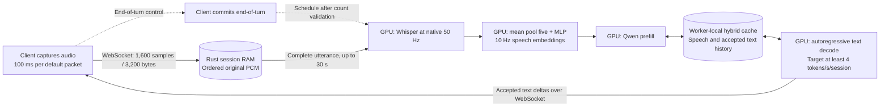

# Model integration status — 2026-10-07

The completed 10 Hz step-9,550 checkpoint is integrated in an independent serving snapshot. The [RTX 3090 benchmark report](GPU_BENCHMARK_3090.md) records its exact configuration/hash, 65 passing on-node Python tests, native-cache and ragged-batch checks, multi-turn speech, interruption and throughput/admission measurements. Model-quality selection and long-duration capacity remain separate validation work. The earlier [step-3,200 shared-node check](DEPLOYMENT_3090.md) is retained as historical evidence. The mean-pool-five architecture matches the serving adapter; the archived 2.5 Hz research selection is superseded for this deployment.

## Architecture comparison

| Component | Training reference | Serving adapter |
| --- | --- | --- |
| Audio | Mono 16 kHz | PCM16, mono 16 kHz; complete candidate at prepare or final utterance at commit |
| Encoder | Whisper Small, width 768, native 50 Hz | Whisper Small, BF16 |
| Projector | FP32 LayerNorm, mean pool by five, MLP 768 → 1,024 → 2,048 | Same architecture, BF16 serving weights; 10 speech embeddings/second |
| Language model | Qwen3.5-2B | Pinned Qwen3.5-2B text backbone, BF16 |
| Prompt | Chat without system message; empty thinking block | Matching user/assistant delimiters; startup verifies token IDs |
| Decoding | Greedy | Greedy one-step proposals accepted by Rust |
| History | Reference configuration limits earlier text; serving target retains speech/text | Persistent attention, convolution and recurrent state; native-cache/replay and ragged split-cache continuation checked on CUDA |

The research reference is `results_preview/overnight_40k_20261007/replay/speech-projector/results_overnight_20261006/overnight_mean_10hz/config.json`. Its preview checkpoint was loaded into `SpeechProjector` on CPU with strict state-dictionary validation: all names and shapes matched. SHA256: `3e8eb8d7cb446a8f0124496ef28b03c213c9bc1f1de78876ff2a03edfdb2821a`. This checks parameter compatibility only. It is not the selected final retraining checkpoint, and no CUDA inference or output parity was tested.

`backend/config.example.json` still names the earlier `teacher_20000_mlp_10hz` checkpoint and its hash. It is a deployment example; the provisioned node uses `checkpoint-9550/worker.json` with the completed checkpoint's verified hash. Any future quality-selected checkpoint should receive another independent snapshot and identity. Do not substitute the saved 2.5 Hz checkpoint: its tensor shapes can match while its pooling semantics differ.

## Capture and computation

Packets are not separate prefill jobs. Whisper is bidirectional, so the backend encodes a complete candidate waveform. The diagram shows the ordinary commit path; optional `prepare` can perform the same work before commit against an isolated cache branch. Matching commit activates its held first token without a second forward; more audio invalidates it. See [preparation and cache ownership](ENDPOINTING_PREPARATION.md). A one-second utterance normally travels as ten packets and produces ten speech embeddings; partial utterances use the projector's partial-block rule. The gateway accepts a short final packet and validates exact counts, without imposing a wall-clock arrival frequency. The jitter benchmark varies capture intervals between 100 and 110 ms; packet size follows the interval, without changing model pooling.

## Hardware experiment and remaining work

The [current RTX 3090 report](GPU_BENCHMARK_3090.md) records actual CUDA tests and gateway workloads with the completed checkpoint after training/evaluation exited. The original CPU-only and shared-training checks remain historical records.

The correctness showcase now runs actual audio in, streamed text out, multi-turn cache continuation, interruption and independent sessions. One RTX 3090 has been tested; a multi-GPU host is the next topology experiment. GPU count is configurable. Each GPU holds its own full model replica and conversation caches, and the Rust gateway shares the host. Device memories are separate; session placement does not pool them.

Two 12 GB RTX 3060s are a possible lower-cost multi-worker experiment, subject to current rental offers and measured model/workspace memory. They require limits sized for their smaller memory, rather than copying the current deployment example unchanged. Neither their feasibility nor their response latency has been validated. The memory specifications are from [NVIDIA's RTX 3090 page](https://www.nvidia.com/en-eu/geforce/graphics-cards/30-series/rtx-3090/) and [RTX 3060 announcement](https://nvidianews.nvidia.com/news/nvidia-introduces-geforce-rtx-3060-next-generation-of-the-worlds-most-popular-gpu/). A faster GPU may improve forward time; complete response latency also includes utterance processing, queueing, cache manipulation and transport.

The provided one-GPU node uses a separate serving directory and environment. Its PyTorch 2.6.0+cu124/Transformers 5.13.0 stack and existing fast kernels passed both CUDA cache tests and the documented load sweep. The backend also supports the pure PyTorch linear-attention fallback. These short experiments do not establish sustainable session capacity or general fast-kernel performance across hardware.

Subsequent profiling and workload validation are complete: the [CPU/CUDA decoder profile](GPU_DECODE_OPTIMIZATION_3090.md) identifies and removes redundant cache copies, and the [staggered conversation benchmark](GPU_STEADY_STATE_3090.md) measures random ten-second arrivals, a separate measurement interval and Rust orchestration boundaries. At 32 sessions, every session produced text and had rolling-rate observations above four tokens/second, but 212 turn-start attempts were refused during measurement. This does not establish refusal-free or sustained capacity.

Remaining validation and extensions:

1. Validate the training project's quality-selected checkpoint through the serving adapter; the step-9,550 checkpoint used for runtime benchmarks is already copied, hashed and integrated.
2. Extend the existing one-GPU deployment to multi-worker hardware when that experiment is needed.
3. Complete audio-reference/projector parity and broader mixed-context checks; native cache continuation, ragged decode and gateway interruption now pass.
4. Extend the existing profiles and short workload measurements to varied utterances, longer contexts and sustained runs.
5. Tune reactive admission and batching against per-session four-token/second throughput and turn-start refusals. Record the utterance, context and output lengths with capacity results.

The detailed correctness and performance procedure is in [HARDWARE_VALIDATION.md](HARDWARE_VALIDATION.md). The [initial GPU report](GPU_BENCHMARK_3090.md) establishes model integration; the [current staggered report](GPU_STEADY_STATE_3090.md) records the latest workload and orchestration timings. Training-reference quality parity, mixed long-context workloads, multiple physical GPUs and sustained capacity remain untested.

## Validation of the cadence update

The default benchmark, aligned suite scenario and example client now send 100 ms packets. The jitter scenario uses 100–110 ms. The network multi-turn/churn test uses 250 ms utterances, exercising two full packets and a short tail through gateway count validation. Historical performance reports retain their original packet timing.

For the earlier cadence update on 7 October, `cargo fmt --check`, `cargo clippy --all-targets --locked -- -D warnings` and `cargo test --locked` passed (47 tests; the cross-language test is normally ignored). The cross-language test was also explicitly run and passed. `uv run pytest -q` in `backend/` passed 54 tests with the two CUDA integration tests skipped. Cargo was invoked by its installed absolute path because this shell's PATH omitted it. CUDA was not tested at that stage; the later BF16 integration and 57-test CPU suite are recorded in [DEPLOYMENT_3090.md](DEPLOYMENT_3090.md).
